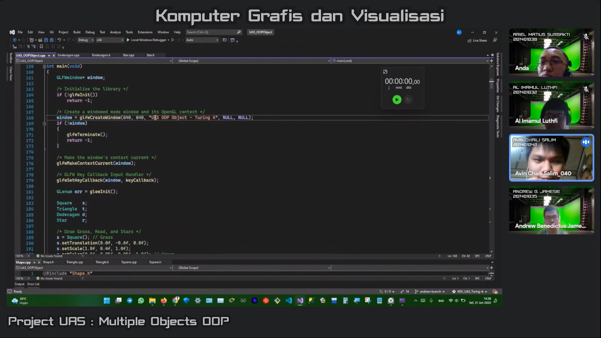
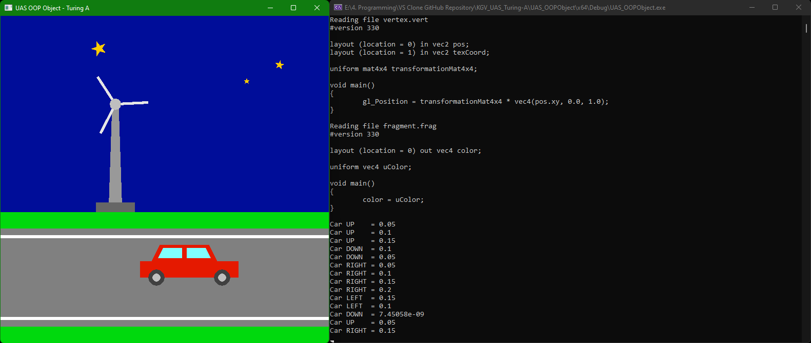

# KGV_UAS_Turing-A
#### Ujian Akhir Semester Mata Kuliah Komputer Grafik dan Visualisasi
#### Dosen Pengampu: Jos Timanta Tarigan, S.Kom., M.Sc.
#### Tahun Ajaran: Genap 2021/2022
#### Ilmu Komputer - Universitas Sumatera Utara

# 
**Kelompok Alan Turing Kom A**  
**1. 201401032 - Al Imamul Luthfi**  
**2. 201401035 - Andrew Benedictus Jamesie**  
**3. 201401038 - Ariel Matius Surbakti**  
**4. 201401040 - Avin Chaili Salim**  

**YouTube Video**  

# 
# Deskripsi Tugas
> Anda ditugaskan untuk membangun sebuah aplikasi komputer grafis menggunakan [GLFW](https://www.glfw.org "Graphics Library Framework") dan [GLEW](http://glew.sourceforge.net "OpenGL Extension Wrangler Library") yang dapat menggambar sebuah gambar dengan menggunakan beberapa objek dari 4 jenis bentuk atau lebih. Adapun spesifikasi gambar yang harus ditampilkan adalah sebagai berikut:
> 1. Aplikasi yang dibangun menggunakan konsep OOP di mana setiap bentuk memiliki sebuah kelas dan proses penggambaran bentuk tersebut dilakukan dengan menggunakan objek dari kelas tersebut.
> 2. Anda dapat menggunakan 2 buah bentuk yang telah dijelaskan pada tutorial mata kuliah (segitiga dan persegi). Anda wajib mendefinisikan 2 buah bentuk lain (seperti oktagon, _hexagon_, bintang, huruf, atau simbol lainnya) dengan membuat 2 buah kelas lain. Setiap bentuk harus memiliki jumlah sudut yang berbeda (misal: tidak boleh menambahkan bentuk segitiga siku-siku atau segitiga sama sisi karena memiliki jumlah sudut yang sama dengan segitiga). Nilai bonus akan diberikan jika proses penentuan nilai _vertex_ pada kedua buah bentuk baru dilakukan secara prosedural (seperti pada UTS).
> 3. Tambahkan _input-handler_ pada program Anda yang dapat melakukan perubahan pada gambar seperti perubahan warna atau transformasi objek. Nilai bonus akan diberikan jika perubahan tersebut berupa animasi (relatif terhadap waktu).
> 
> Untuk menghindari plagiarisme, Anda wajib mengirimkan hasil objek yang dibangun pada grup LINE mata kuliah. Tidak boleh ada 2 kelompok menggunakan objek dengan bentuk yang sama.
> 
> Anda juga ditugaskan untuk membuat satu buah video tutorial yang menjelaskan aplikasi dan kode yang Anda bangun dengan durasi minimal 5 menit dan maksimal 7 menit. Video Anda harus memiliki spesifikasi sebagai berikut,
> 1. Video harus menampilkan logo USU/Fasilkom-TI di awal Video;
> 2. Video harus menampilkan nama dan NIM setiap anggota kelompok;
> 3. Video harus menampilkan orang yang sedang menjelaskan;
> 4. Suara yang dihasilkan oleh orang harus jelas;
> 5. Ukuran video minimal adalah 720p (1280 x 720) dan seluruh teks (presentasi, kode) harus dapat terbaca dengan jelas.
> 
> Unggah _project_ Anda (yang dapat dijalankan pada Visual Studio) pada GitHub dan lampirkan _link_ GitHub pada deskripsi video Anda. **(10 poin)**
> 
> **Metode dan Batas Waktu Pengumpulan**
> Video diunggah ke Youtube. Link dikumpulkan via e-Learning dengan menggunakan _activity_ yang telah ditentukan. Adapun batas waktu pengumpulan adalah **Selasa, 20 Juni 2022 pukul 23.59 WIB**.

# 
# Tugas 3 KGV Kelompok Turing-A
**UAS_OOPObject**
> - Project ini berupa program visual untuk menampilkan gambaran mobil, kincir angin, dan bintang yang dibentuk dari beberapa objek persegi, segitiga, segi dua belas (_dodecagon_), dan bintang (_star_). Objek-objek tersebut ditranslasi atau perpindahan, dirotasi, dan diskalasi atau dilatasi sehingga membentuk sebuah rumah.
> - Folder ini merupakan project/solution **Console Application** Visual Studio, sehingga bisa di-_compile_ dan dijalankan dengan menggunakan Microsoft Visual Studio.
> - Dalam folder ini terdapat file Program `.sln` yang dapat dibuka dengan menggunakan Visual Studio.
> - Sedangkan jika hanya ingin melihat _source code_-nya akan dijelaskan di bawah.
> 
> **Multiple Objects OOP**  
> 

# 
# Note:
#### Dalam folder ini terdapat 14 file yang penting, yaitu:
- **UAS_OOPObject.cpp**  
  Ini adalah _file_ utama dari project/solution ini. Dalam _file_ ini dilakukan pembuatan _window_ untuk menampilkan gambar objek, perintah untuk melakukan translasi, rotasi, dan dilatasi, perintah untuk melakukan penggambaran objek, input handler dengan keyCallback untuk melakukan perpindahan objek mobil, serta animasi perputaran baling-baling kincir angin yang relatif terhadap waktu menggunakan glfwGetTime().
- **Shape.cpp**  
  Ini adalah _cpp file_ untuk _class_ Shape. _Class_ ini merupakan _parent class_ dari beberapa _class_ lainnya. Dalam _file_ ini terdapat isi dari _constructor_, serta _setter_ and _getter_ semua _method_ yang telah dideklarasikan terlebih dahulu di file `Shape.h`.
- **Square.cpp**, **Triangle.cpp**, **Dodecagon.cpp**, **Star.cpp**  
  Ini adalah _cpp file_ untuk _class_ Square, Triangle, Dodecagon, dan Star. _Class_ ini merupakan _child class_ yang merupakan inheritance dari _parent class_-nya yaitu `Class Shape`. Dalam _file_ ini terdapat isi dari _constructor_ dan _method_ Draw yang telah dideklarasikan terlebih dahulu di file `Square.h`, `Triangle.h`, `Dodecagon.h`, dan `Star.h`.  
  _Class_ ini berfungsi untuk melakukan _link_ dan _binding data_ `vertexArray` dan `vertexBuffer` serta `indexBuffer` sehingga didapatkan penggambaran dasar dari setiap bangun datar yang dibentuk. Sedangkan pada masing-masing `header file`-nya berfungsi untuk menyimpan data `vertices` atau titik dari bangun datar tersebut, serta data `indexArr` untuk membentuk bangun datar tersebut yang terbentuk dari beberapa segitiga.
- **Util.h**  
  Ini adalah _file_ untuk menghubungkan _file_ utama `UAS_OOPObject.cpp` dengan _file_ vertex dan fragment, yaitu `vertex.vert` dan `fragment.frag`. _File_ ini juga berfungsi untuk melakukan _debugging_ yang akan ditampilkan pada console/terminal pada saat menjalankan (_run_) program.
- **vertex.vert**  
  Ini adalah _file_ untuk menentukan penggambaran posisi dari `vertices` dan `indexBuffer` yang akan dihubungkan dengan variabel uniform `transformationMat4x4` untuk melakukan pengubahan gambar bangun datar, baik translasi, rotasi, dan dilatasi. Pointer location 0 digunakan untuk pointer data posisi _vertices_, sedangkan pointer location 2 untuk menentukan _texture_ objek.
- **fragment.frag**  
  Ini adalah _file_ untuk menentukan pewarnaan fragment color, yaitu `uColor` yang diambil dari `color` untuk menghasilkan warna yang telah diatur dalam _method setter_.
